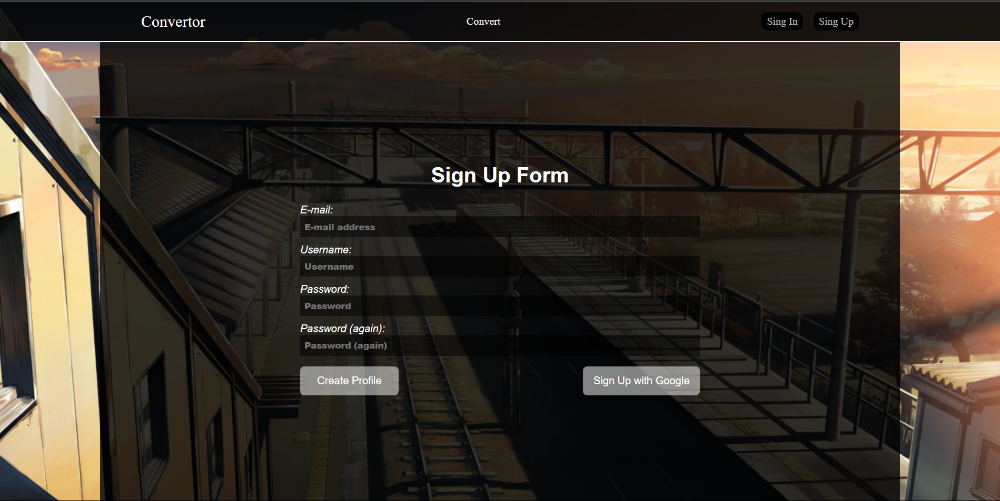

<center><h1>Django Convertor Project</h1></center>

## For Django Convertor Project you need:
- Docker
## Instruction
- After installation docker on your desktop run command 
```
----------------------------------------------------
docker-compose up -d --build
----------------------------------------------------
docker-compose exec web python manage.py migrate csvtoxml
----------------------------------------------------
```
## By 127.0.0.1:8000 you can see result
Registration and Log in pages:




Another pages:


